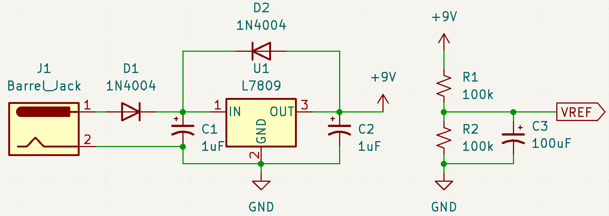
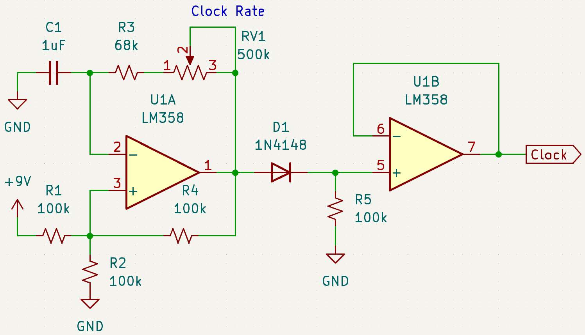

# Apothem

Apothem is a standalone analog synthesizer built with common resistors, potentiometers, capacitors, diodes, transistors, and integrated circuits.

## Power

Recommended power adapter is 12 VDC.

All ICs are equipped with 100nF decoupling capacitors close to the power pins.

## Clock

The clock signal is used for the sequencer.

## Sequencer

## VCO

## LFO

## VCF

## AR

## VCA

## Output